  

---

## Robot Build

  

---

### Tech Arsenal

**Languages**

**Frameworks**

**Cyber/Dev Tools**

---

### Live GitHub Stats

---

## 🎛️ Live Cyber Terminal

---

### Featured Projects

| Project | Tech Stack | Status |
|---------|------------|--------|
| Mini Bank & Expense Tracker | FastAPI, Python, JavaScript, HTML/CSS | Active |
| AI-Nazer LMS Platform | Next.js, React, Supabase, Tailwind | Deployed |
| Madar AI Platform | Next.js, Supabase, OpenAI API | In Development |

---

## 💬 Cyberpunk Neural Quotes & System Philosophy

  

---

## 🐍 Cyberpunk Contribution Grid

  

---

### Connect

  

